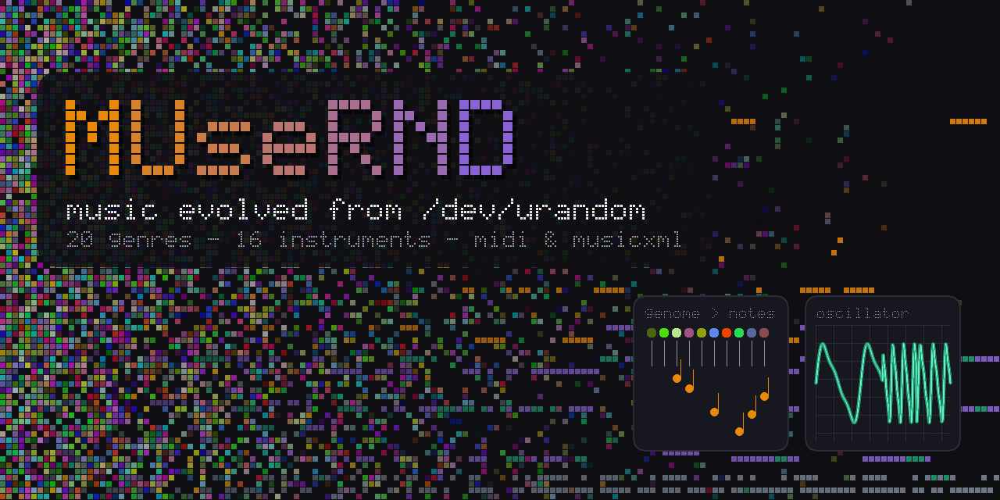

<p align="center">
  
</p>

# MUseRND

**Music evolved from `/dev/urandom`.**

MUseRND composes music from pure randomness. Every note of the melody, every
chord, bass note, drum hit and extra instrument starts life as random bytes
read from `/dev/urandom`. An evolutionary search then breeds those bytes,
keeping the variations that a set of music-theory detectors rate as more
musical, until a song emerges. Nothing is copied from existing music and no
notes are written by rules: the rules only *judge*, the randomness *creates*.

Songs are saved as **Standard MIDI** and **uncompressed MusicXML**, ready for
any DAW, notation program or synthesizer, together with the **genome** (the
evolved bytes) so every song can be rebuilt exactly. A browser UI lets you
compose, listen, edit and keep a library of songs.

It is a single Go binary with no dependencies outside the standard library.

---

## Highlights

- **Everything from `/dev/urandom`.** Melody, chords, bass, drums and up to
  12 extra instruments are all decoded from random bytes and evolved.
- **20 genres** in five groups: pop, blues, house, ambient · rock, funk,
  jazz, soul · techno, trap, drum & bass, synthwave · reggae, bossa nova,
  latin (son clave), afrobeat · waltz, minuet (3/4), ballad, jig (6/8). Each
  genre has its own grooves, chord vocabulary and rhythms, bass role, scale
  and instruments, and is judged by its own rules (ii–V–I for jazz,
  one-drop for reggae, clave for latin, the 12-bar form for blues, …).
- **4/4, 3/4 and 6/8 time** throughout: generation, scoring, MIDI, MusicXML,
  playback.
- **Mood:** 11 presets (balanced, calm, energetic, dark, bright, melancholic,
  dreamy, aggressive, epic, romantic, playful) or five sliders — energy,
  darkness, density, swing, complexity.
- **Scales and keys:** auto-detected or chosen — major, minor, natural and
  harmonic minor, the church modes, pentatonics, blues — in any key.
- **Up to 16 instruments:** melody, chords, bass and drums plus up to 12
  extra parts with roles: counter-melody, arpeggio, pad, stabs, percussion.
  Any of the 128 General MIDI instruments, 8 drum kits, 47 percussion sounds.
- **Variations:** re-evolve a song while locking parts — whole instruments,
  a range of bars, or both.
- **Edit after generating:** transpose (also part-locked, or as a key change
  from a chosen bar), change the tempo (also only for a section), switch
  instruments (also mid-song) — without changing the notes.
- **Taste learning:** rate songs 👍/👎 and MUseRND learns what you like
  (note density, register, repetition, silence, …) and steers new songs
  towards it.
- **Your own sounds:** upload SoundFonts (`.sf2`, `.sf3`, `.sfogg`, `.dls`)
  and play songs through them, including real drum kits.
- **Reproducible:** the `.genome` file stores the evolved bytes and all
  settings; `musernd render` rebuilds the exact MIDI and MusicXML.

## How it works

1. **Genome.** A song is a byte string from `/dev/urandom`: three bytes per
   melody note (pitch, length + stereo position, volume — the layout of an RGB
   pixel, which is where the project began) followed by per-bar genes for the
   chord, the bass line, the drum pattern and every extra part.
2. **Decoding.** The genre turns genes into music: which chords a byte can
   pick, which note lengths exist, how the bass reads its slots, which drum
   sounds play. The vocabulary is musical; the choices are random.
3. **Detectors.** Every candidate is scored: key clarity and scale use,
   smooth melodic motion, rhythm, rests, range, recurring motifs, cadences;
   chords that fit the melody and progress well; a bass that supports the
   harmony in the genre's way; drums close to the genre's reference grooves;
   melody kept above the chords, without unison doubling. Weak parts cost
   extra, so a song cannot pass on its melody alone.
4. **Evolution.** A population of genomes is bred with crossover and
   mutations (pitch nudges, motif copies and sequences, groove spreading, …);
   every random choice again comes from `/dev/urandom`. The search stops at
   the target score or when its time budget runs out.
5. **Output.** The best arrangement is written as MIDI (one track per part,
   GM instruments, key/tempo/time-signature events) and MusicXML (one staff
   per part, notes spelled for the key, ties across bar lines).

## Installation

Requirements: **Go 1.22 or newer**, and a system with `/dev/urandom`
(Linux, macOS, BSD).

```sh
git clone git@github.com:petroffspace/MuseRND.git
cd MuseRND
go build -o musernd .
```

That's the whole build: the web UI (HTML, CSS, JS and the bundled
SpessaSynth player) is embedded in the binary.

Cross-compiling, e.g. for a Raspberry Pi 5 (64-bit):

```sh
CGO_ENABLED=0 GOOS=linux GOARCH=arm64 go build -trimpath -ldflags="-s -w" -o rpi/musernd .
```

## Usage

### Web UI

```sh
./musernd serve                     # http://localhost:9090
./musernd serve -addr :8080 -library LIBRARY -soundfonts SOUNDFONTS
```

| Flag          | Default        | Meaning                                    |
|---------------|----------------|--------------------------------------------|
| `-addr`       | `:9090`        | listen address                             |
| `-library`    | `LIBRARY`      | where songs made in the UI are saved       |
| `-soundfonts` | `SOUNDFONTS`   | where uploaded SoundFonts are stored       |
| `-source`     | `/dev/urandom` | random byte source                         |

In the browser:

1. **Compose** — pick a genre, a style (mood) or the mood sliders, scale,
   key, tempo, length in seconds and parts. Choose instruments or roll the
   🎲 dice; **+ Add instrument** adds extra parts (up to 16 in total).
2. **Generate** — watch the score climb live; the song opens when done.
3. **Listen** — play/pause (space), seek on the piano roll, mute parts,
   choose the default online sounds or one of your SoundFonts.
4. **Edit** — select bars by dragging across the piano roll, then transpose,
   change tempo or switch instruments, with locks for parts and bars.
5. **Vary** — lock what you like and let the rest evolve again.
6. **Rate** — 👍/👎; tick *Use my ratings* to let your taste steer new songs.
7. **Save** — download **MIDI**, **MusicXML** or the **genome**.

Playback uses the FluidR3 General MIDI sounds loaded on demand from a CDN,
or any SoundFont you upload (played locally by SpessaSynth). Exports are
always MIDI and MusicXML; audio is only for listening.

### Command line

```sh
# 10 jazz songs into songs/: jazz01.genome/.mid/.musicxml … plus generate.log
./musernd generate -style jazz -count 10 -name jazz songs/

# rebuild MIDI and MusicXML from saved genomes (e.g. after updating MUseRND)
./musernd render songs/*.genome
./musernd render -bpm 96 songs/jazz01.genome

# show a song's full score breakdown and chord progression
./musernd score songs/jazz01.genome
```

`generate` flags:

| Flag           | Default        | Meaning                                                     |
|----------------|----------------|-------------------------------------------------------------|
| `-style`       | `pop`          | genre (`./musernd` without arguments lists all 20)          |
| `-count`       | `1`            | number of songs                                             |
| `-name`        | `melody`       | file name prefix                                            |
| `-start`       | `1`            | first song number (to continue a series)                    |
| `-notes`       | genre default  | melody length in notes                                      |
| `-target`      | `90`           | stop when the total score reaches this (0–100)              |
| `-generations` | `30000`        | search limit per attempt                                    |
| `-attempts`    | `3`            | restarts from fresh random bytes if the target is missed    |
| `-population`  | `64`           | genomes per generation                                      |
| `-bpm`         | genre default  | tempo                                                       |
| `-accomp`      | `all`          | `all`, `none`, or a list of `bass,chords,drums`             |
| `-source`      | `/dev/urandom` | random byte source                                          |

### Files

| File              | Contents                                                                 |
|-------------------|--------------------------------------------------------------------------|
| `*.mid`           | Standard MIDI file, format 1: one track per part, GM programs, drums on channel 10 |
| `*.musicxml`      | uncompressed MusicXML 4.0: one part per instrument, percussion staves, key/time/tempo |
| `*.genome`        | the evolved bytes plus the settings to rebuild the song exactly          |
| `LIBRARY/<id>/`   | a UI song: `song.genome`, `song.mid`, `song.musicxml`, `meta.json`       |

## Project layout

```
main.go                     command line: generate, render, score, serve
internal/melody/            the composer
  notes.go, score.go        melody genes and the melody detector
  arrange.go, harmony.go    genome layout; chords, bass, drums
  extras.go                 extra parts (counter-melody, arpeggio, pad, stabs, percussion)
  compose.go                accompaniment detectors and the total score
  evolve.go                 the evolutionary search, locks, variations
  style.go, genres.go       genre presets, meters
  scales.go, settings.go    scales and modes, user settings, moods
  taste.go                  learning from ratings
  midi.go, musicxml.go      exporters
  genomefile.go             the .genome format
internal/web/               HTTP API, library, SoundFont uploads
  static/                   the browser UI (embedded in the binary)
tools/titlecard/            draws docs/titlecard.png (go run ./tools/titlecard)
```

## Development

```sh
go vet ./...
go test ./...
go run ./tools/titlecard      # a new title card, from /dev/urandom of course
```

## Third-party components

- [SpessaSynth](https://github.com/spessasus/spessasynth_lib) (`spessasynth_lib`
  and `spessasynth_core`, Apache-2.0) — bundled in
  `internal/web/static/vendor/` for SoundFont playback; see the licence files
  there.
- [soundfont-player](https://github.com/danigb/soundfont-player) and the
  FluidR3 GM samples from
  [midi-js-soundfonts](https://github.com/gleitz/midi-js-soundfonts) — loaded
  by the browser from a CDN for the default sounds; see those projects for
  their licences.

## License

[MIT](LICENSE) © petroffspace.com
